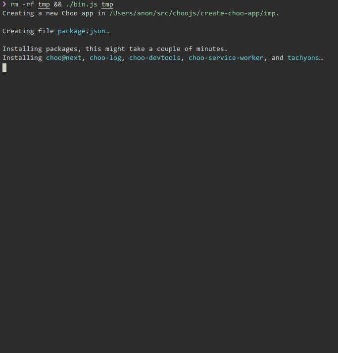

+++
title = 'choo-v6'
created = '01-08-2017'
+++

Heya, today we're releasing choo `v6.0.0`. After 5 release candidates, we're
happy to finally share it with the world. We're also happy to announce
`create-choo-app`, [github.com/choojs](https://github.com/choojs), and
`nanocomponent v6.0.0`

## ChooJS Organization
Choo is about 1 year old now. With almost daily commits in the source, and
contributors from across the world, we've decided to take the leap, and move
all our projects into [the ChooJS GitHub organization](https://github.com/choojs).

The goal is to make invididual projects easier to discover, but also to improve
the way we think, plan and collaborate on Choo and its ecosystem.

## Create Choo App
Choo has a vibrant ecosystem, and to help people get started we've released
[create-choo-app](https://github.com/choojs/create-choo-app). It creates a
fresh project with all files, dependencies and script ready to run. Going from
zero to Choo will now be instant.

```sh
$ create-choo-app my-app
```



## Nanocomponent
🎉 `nanocomponent` and `cache-component` are merged into one module:
[`nanocomponent@6.0.0` 🎉](https://github.com/choojs/nanocomponent). This has
been in the works for about half a year now, and we're thrilled to finally be
able to share this with everyone.

For those of you unfamiliar with `nanocomponent`: it's a module that allows you
to create native DOM components, that work well with declarative rendering
engines. This allows you to do all sorts of cool things, like [persistent WebGL
contexts](https://github.com/substack/regl-component), [60fps infinite
lists](https://github.com/hypermodules/hyperamp/blob/546404cc3d87b3feb4f47cee35f2c1a25c06df39/renderer/elements/playlist/rows.js),
[maps](https://github.com/substack/mixmap) and many more.

Nanocomponent is useful in scenarios where you need local state in a component,
or need to wrap 3rd party libraries that take care of its own rendering.

Through the use of
[adapters](https://github.com/yoshuawuyts/nanocomponent-adapters) these modules
can be reused in all frameworks with almost no cost. We hope this will make it
easier for people to "write once, deploy everywhere" for components 🙌.

## Choo
The biggest focus in this release was to take the API we created in Choo 5, and
really polish it. Internally Choo has almost completely been rewritten, but
we've kept the API stable. Upgrading from 5 to 6 should _just work™_ for most
people.

### Upgraded render engines
__Tl;Dr__: things are faster, and more stable .
Choo v6 includes the upgrades to `bel@5` and `nanomorph@5`. This means up to
20x faster server rendering, and up to 10x improved browser rendering speeds.
We've also fixed DOM node caching, and introduced sibling node reordering.
💯

### Prototypes
Choo is now completely prototype based. It not only means faster execution
times, and more maintainable codebase - but you can also override methods if
you ever need to.

### Events
We've also tweaked the event system a little. All built-in event names are now
available as constants under `app.state.events`. And we've introduced three new
events: `'navigate'` will trigger whenever a route changes, `'replaceState'`
can be called to redirect routes, and `popState` which is emitted when the back
button in the browser is pressed.

```js
var app = choo()
app.use(function (state, emit) {
  emitter.on(state.events.DOMCONTENTLOADED, function () {
    emitter.emit(state.events.NAVIGATE, function () {
      console.log('navigated to ' + window.location)
    })
  })
})
```

### Tracing
Choo 6 introduces timings for just about everything that happens. Emitting an
event? check. Rendering a view? check. Calling `app.use()`. check check check.
`choo-log` is the first module to make use of these traces, but any module can
hook into these traces and use them however they like. We think that's rather
neat.

We plan to extract the tracing code from `choo-log` in the near future, but if
you want to get started with gathering all of Choo's trace events right away
you can use the [on-performance](https://github.com/yoshuawuyts/on-performance)
module:

```js
var onPerformance = require('on-performance')

onPerformance(function (entry) {
  console.log(entry)
})
```

### Query Strings & Current Location
To top things off, we've reintroduced querystring parsing. An object containing
the current represenation of the search query (e.g. `?foo=bar`) can be found
under `state.query`. We used to do something similar in choo v4 and below, and
we're happy to reintroduce it in this release!

You can also access the current location through `state.href`. We added this
because `window.location` isnt' available in Node, but it's not uncommon to
need to access it when rendering.

```js
var html = require('choo/html')
var choo = require('choo')
var app = choo()
choo.route('/', function (state, emit) {
  return html`
    <body><ul>
      <li>Href is ${state.href}</li>
      <li>Query is ${state.query}</li>
    </ul></body>
  `
})
app.render('body')
```

## Wrapping Up
And that's it. Thanks to everyone that's contributed over the past few months,
and thanks to our [OpenCollective
contributors](https://opencollective.com/choo) for the financial support. We
couldn't do this without any of you.

Catch you next time! -Team Choo
